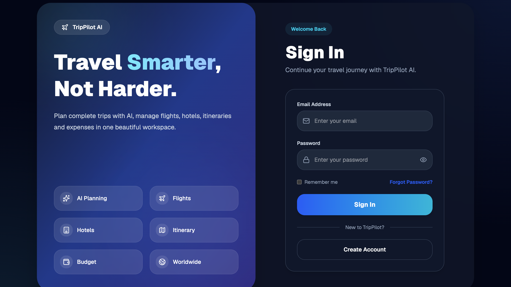
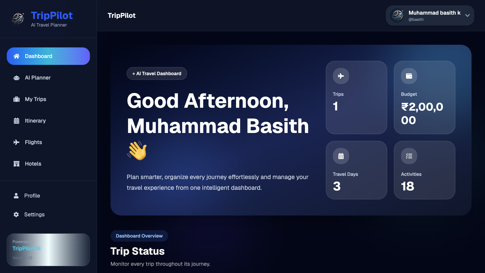
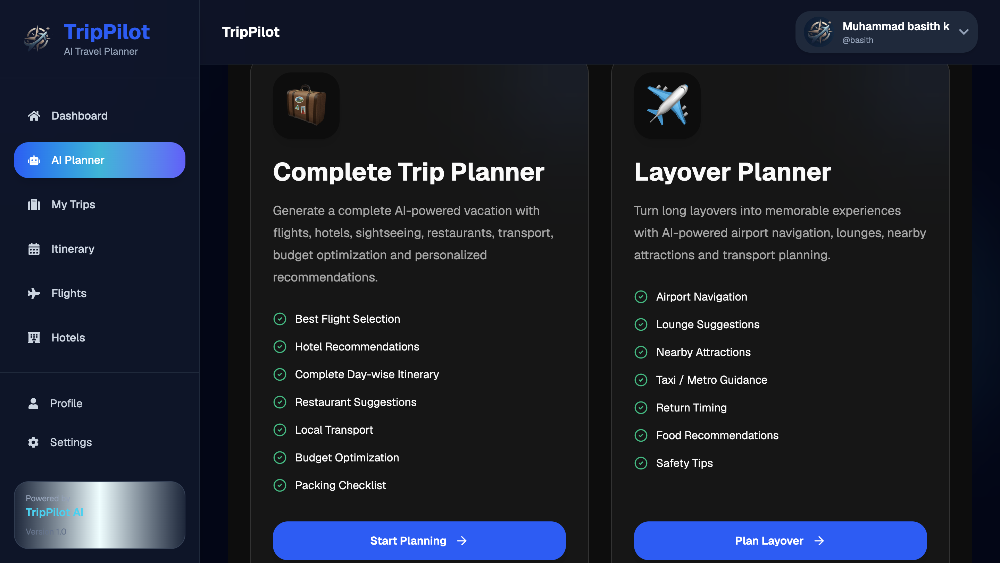
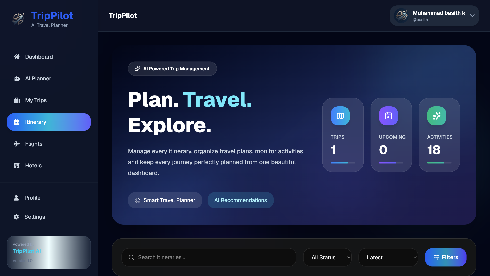
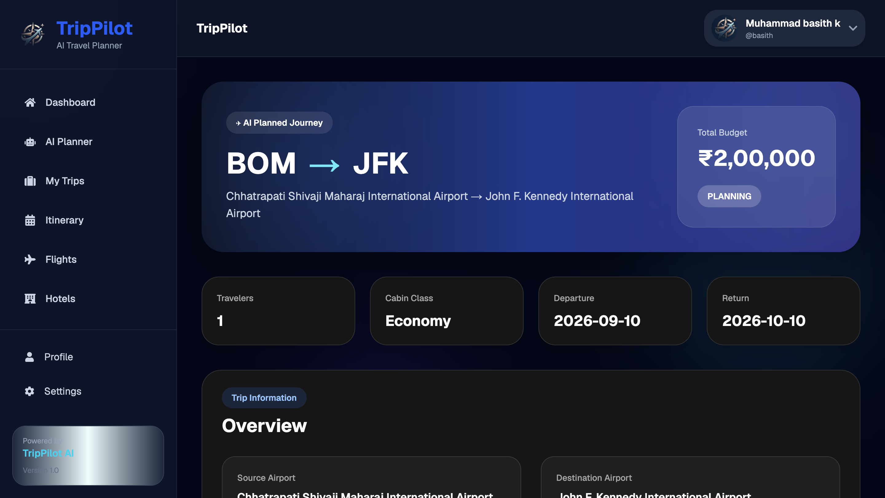
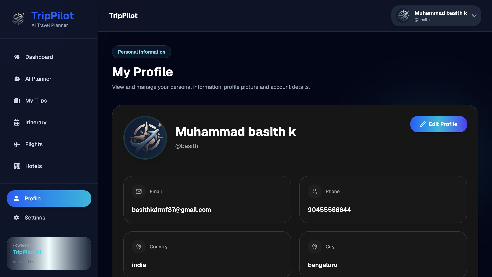
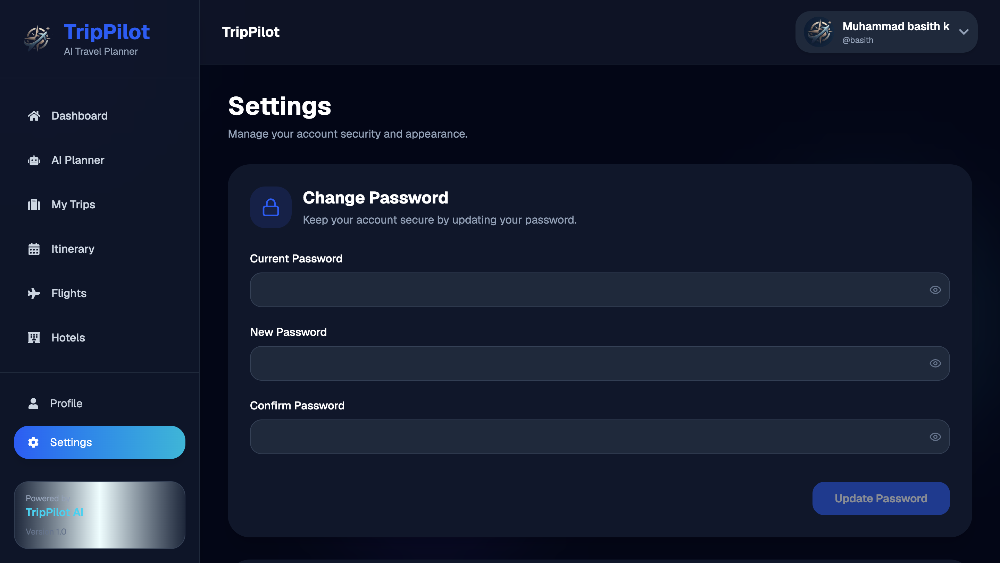

<p align="center">
  
</p>

<h1 align="center">✈️ TripPilot</h1>

<p align="center">
AI-Powered Travel Planning Platform
</p>

<p align="center">
A modern full-stack travel planning platform that turns a few trip details into a complete AI-generated itinerary — flights, hotels, day-by-day activities, budget breakdowns, and even layover planning.
</p>

---

<p align="center">


</p>

<p align="center">

🤖 AI Trip Planner • 🛫 Layover Planner • 🔐 JWT Authentication • ☁️ Cloudinary • 🚀 Production Ready

</p>

---

# 🧩 Core Modules

### 🧳 Trip Planner

- Multi-step guided trip form (airports, dates, budget, preferences)
- AI-generated full itinerary — flights, hotels, activities
- Budget-aware recommendations
- Save & manage generated trips

### 🛫 Layover Planner

- Enter connecting flight schedule (arrival + departure)
- AI builds a time-boxed mini-itinerary for your layover window

### 👤 Account & Profile

- Register & Login (JWT)
- Forgot / Reset Password via email
- Editable Profile with Cloudinary-hosted avatar
- Theme, currency & language preferences

### 📊 Dashboard

- Aggregated trip overview
- Per-trip budget summary
- Itinerary breakdown by day

---

## 🌐 Live Demo

| Platform | Link |
|----------|------|
| 🌐 Live Website | https://trip-pilot-nu.vercel.app |
| ⚙️ Backend API | https://trippilot-backend.onrender.com |

---

## 📸 Project Preview


---

# 🎯 Why TripPilot?

Planning a trip usually means juggling a dozen tabs — flight search, hotel
comparisons, "things to do" lists, and a budget spreadsheet on the side.
TripPilot collapses all of that into one guided flow.

Tell it where you're going, when, and your budget, and Google Gemini
generates a complete, personalized itinerary in seconds — matched flights,
hotel picks, a day-by-day activity plan, and a budget summary. Long layover
on the way? The dedicated Layover Planner turns dead airport time into a
mini-itinerary of its own.

The platform demonstrates a production-ready full-stack architecture using
Next.js, Django REST Framework, PostgreSQL, JWT Authentication, Cloudinary,
Google Gemini, and modern deployment practices.

---

## ✨ Features

### Traveler

- JWT Authentication
- AI Trip Planner (multi-step form)
- AI Layover Planner
- Trip Dashboard
- Itinerary & Budget Breakdown
- Profile Management with Avatar Upload

### AI Engine

- Gemini-powered itinerary generation
- Real flight-route matching with intelligent fallback
- Preference-aware hotel & activity suggestions
- Budget-constrained recommendations

---

## 🛠 Tech Stack

| Category | Technology |
|------------|-------------------------|
| Frontend | Next.js, TypeScript, Tailwind CSS |
| Backend | Django REST Framework |
| AI | Google Gemini API |
| Database | PostgreSQL (Neon) |
| Storage | Cloudinary |
| Email | Resend |
| Deployment | Vercel, Render |

---

# 📊 Project Highlights

| Feature | Status |
|----------|--------|
| 🔐 JWT Authentication | ✅ |
| 🤖 AI Trip Generation | ✅ |
| 🛫 Layover Planner | ✅ |
| 💼 Trip Management | ✅ |
| 📅 Itinerary Breakdown | ✅ |
| 💰 Budget Summary | ✅ |
| ☁️ Cloudinary Storage | ✅ |
| 📱 Responsive Design | ✅ |
| 🌗 Dark Mode | ✅ |
| 🚀 Production Deployment | ✅ |

---

## 📂 Project Structure

``` text
TripPilot/
├── backend/
├── frontend/
├── docs/
│   ├── screenshots/
│   ├── architecture/
│   └── api/
├── README.md
└── LICENSE
```

---

# 🏗️ System Architecture

```text
                +----------------------+
                |     Next.js App       |
                |  (Frontend - Vercel)  |
                +----------+-----------+
                           |
                        REST API
                           |
                           ▼
                +----------------------+
                | Django REST API      |
                | JWT Authentication   |
                +----------+-----------+
                           |
        +------------------+------------------+
        |                                     |
        ▼                                     ▼
+--------------------+             +------------------+
| PostgreSQL (Neon)  |             | Cloudinary       |
| Users, Trips, Data |             | Profile Pictures |
+--------------------+             +------------------+
                           |
                           ▼
                 +----------------------+
                 | Google Gemini AI     |
                 | Itinerary Generation |
                 | Flight & Hotel Match |
                 | Layover Planning     |
                 +----------------------+
```

---

## 📸 Application Gallery

### 🔐 Authentication



---

### 📊 Dashboard



---

### 🤖 AI Planning



---

### 🗓️ Itinerary



---

### 🧳 Trip Details



---

### 👤 Profile



---

### ⚙️ Settings



---

# 📡 REST API

| Module | Endpoint |
|---------|----------|
| Authentication | `/api/v1/accounts/login/` |
| Registration | `/api/v1/accounts/register/` |
| Password Reset | `/api/v1/accounts/forgot-password/` |
| Profile | `/api/v1/accounts/profile/` |
| AI Trip Planner | `/api/v1/ai/generate-trip/` |
| Trips | `/api/v1/trips/` |
| Layover Trips | `/api/v1/layover-trips/` |
| Itinerary Days | `/api/v1/itinerary-days/` |
| Flights | `/api/v1/flights/flights/` |
| Activities | `/api/v1/activities/` |
| Dashboard | `/api/v1/dashboard/` |

---

## 🚀 Getting Started

Follow the steps below to run TripPilot locally for development and testing.

## ⚙ Installation

``` bash
git clone https://github.com/basith670/TripPilot.git
cd TripPilot
```

### Backend

``` bash
cd backend
python -m venv .venv
source .venv/bin/activate
pip install -r requirements.txt
python manage.py migrate
python manage.py runserver
```

### Frontend

``` bash
cd frontend
npm install
npm run dev
```

---

## 🔑 Environment Variables

### Backend

``` env
SECRET_KEY=
DEBUG=
ALLOWED_HOSTS=
DATABASE_URL=
CSRF_TRUSTED_ORIGINS=

CLOUDINARY_CLOUD_NAME=
CLOUDINARY_API_KEY=
CLOUDINARY_API_SECRET=

GEMINI_API_KEY=
GEMINI_MODEL=

RESEND_API_KEY=

FRONTEND_URL=
```

### Frontend

``` env
NEXT_PUBLIC_API_BASE_URL=
```

---

## 🚀 Deployment

| Component | Service |
|-----------|---------|
| Frontend | Vercel |
| Backend | Render |
| Database | Neon PostgreSQL |
| Media Storage | Cloudinary |

**Backend Start Command**

``` bash
gunicorn config.wsgi:application --workers 2 --timeout 120
```

---

## 📈 Roadmap

- Multi-currency live conversion
- Collaborative trip planning
- PDF itinerary export
- Flight price tracking
- Trip reminder notifications

---

## 📈 Repository Overview

- **Frontend:** Next.js + TypeScript + Tailwind CSS
- **Backend:** Django REST Framework
- **AI:** Google Gemini API
- **Database:** PostgreSQL (Neon)
- **Authentication:** JWT
- **Cloud Storage:** Cloudinary
- **Deployment:** Vercel + Render
- **Architecture:** REST API

---

## 👨‍💻 Author

**Muhammad Basith K**

🎓 B.Tech Computer Engineering

🌐 GitHub: https://github.com/basith670

💼 LinkedIn: https://www.linkedin.com/in/muhammadbasithk/

📧 Email: basithkdrmf87@gmail.com

---

## 📄 License

This project is licensed under the **MIT License**.

---

## ⭐ Support

If you found this project helpful, please give it a ⭐ on GitHub.